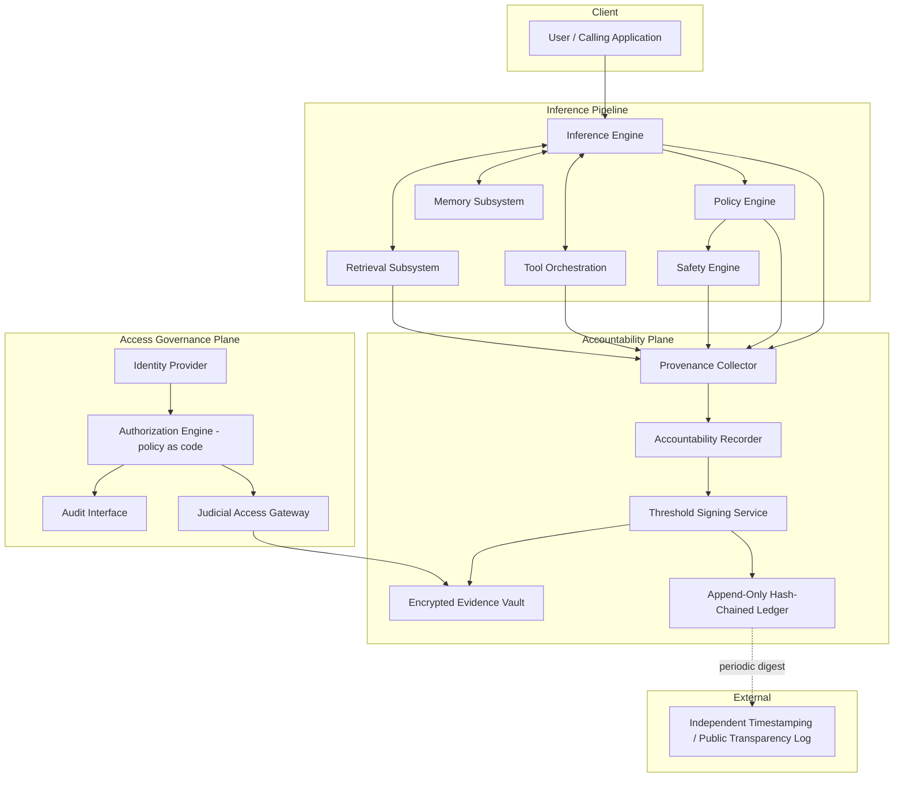
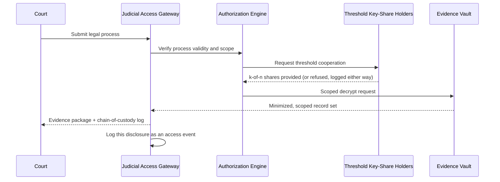

# AI Accountability Infrastructure: A Privacy-Preserving, Judicially Auditable Framework for AI Decision Provenance

**Mezbah Uddin Rafi**

**Type of contribution:** Systematization of Knowledge (SoK) and Formal Framework Paper — Computer Security / AI Governance / Privacy Engineering

---

## Abstract

Consequential decisions in law, medicine, finance, and public services are increasingly mediated by AI systems, yet no widely adopted infrastructure allows an authorized third party to later verify, with cryptographic assurance, what observable factors caused a specific AI output. Explainable AI (XAI) methods characterize model behavior in general, not a single transaction; governance frameworks specify process, not evidentiary mechanism; and forensic/audit logging is rarely designed for AI-specific provenance (retrieved context, tool invocation, policy evaluation) or for graduated, privacy-preserving legal disclosure. We systematize this gap and propose the **AI Accountability Infrastructure (AAI)**, centered on a formally defined, hash-chained, digitally signed **AI Accountability Record (AAR)** and a graduated, threshold-cryptography-enforced disclosure model in which no single party — including the AI provider — holds unilateral access to evidentiary content. We give (i) a formal model of record integrity and non-repudiation with informal correctness arguments grounded in established cryptographic primitives; (ii) a STRIDE-based threat model spanning both AI-specific and classical evidentiary risks; (iii) a privacy analysis using established data-minimization and disclosure-control concepts; (iv) a complexity and overhead analysis of the proposed mechanisms; and (v) an evaluation methodology intended for future empirical validation. This paper is explicitly a framework and formal-model contribution: it does not report novel experimental results, and we state this limitation directly rather than fabricate benchmark figures. We situate AAI against the NIST AI Risk Management Framework, ISO/IEC 42001, and the EU AI Act, and identify open problems suitable for a doctoral research program.

**Keywords:** AI accountability, decision provenance, explainable AI, tamper-evident logging, threshold cryptography, digital forensics, AI governance, privacy engineering, AI Act, NIST AI RMF

---

## 1. Introduction

### 1.1 Motivation

When an AI system denies a loan, flags content for removal, or supports a clinical decision, the affected party, a regulator, or a court may later need to determine what information the system actually used and whether the record of that event can be trusted. Three problems compound this need. First, **evidentiary infrastructure lags legal exposure**: unlike aviation (flight data recorders) or finance (double-entry, auditable ledgers), AI systems generally lack a standardized, tamper-evident, per-decision evidentiary artifact. Second, **accountability tooling is fragmented**: XAI, policy/governance engines, and logging are typically built independently, by different teams, for different purposes, and their outputs cannot be jointly verified or presented as coherent evidence. Third, there is an unresolved **tension between transparency and confidentiality**: full disclosure of raw logs or internal reasoning traces can violate user privacy, expose proprietary information, or hand adversaries a reconnaissance tool for prompt-injection or jailbreak engineering, while no disclosure defeats accountability entirely.

### 1.2 Scope and a Key Exclusion

This paper is scoped to **decision provenance** — the observable, causally relevant, externally verifiable factors that fed into an AI output: inputs, retrieved context, invoked tools, applied policy/safety checks, and model/version identity. We deliberately **exclude** the reconstruction or exposure of a model's internal, sub-symbolic reasoning trace (e.g., hidden chain-of-thought) from the definition of provenance. This exclusion is a design decision, not an oversight: internal reasoning traces are not a stable, well-defined, or portable artifact across model architectures, and their disclosure would itself create a security liability by giving adversaries higher-fidelity information for crafting attacks against the system, without a commensurate accountability benefit over recording observable causal factors.

### 1.3 Contribution and Honesty of Claims

We make the following contributions, each stated at the level of rigor it actually supports:

1. A **formal definition** of the AI Accountability Record (AAR) and its hash-chain/signature structure, with **informal correctness arguments** (not machine-checked proofs) for integrity and non-repudiation, built directly on established constructions (Merkle authentication, threshold signatures, secure/tamper-evident logging).
2. A **systematization** of prior work across XAI, governance frameworks, forensic logging, and cryptographic transparency mechanisms, identifying a specific, previously unaddressed gap (Section 2.6).
3. A **STRIDE-structured threat model** and mapped mitigations, and a **privacy analysis** grounded in data-minimization and disclosure-control literature.
4. A **graduated disclosure architecture** in which record decryption requires threshold cooperation across roles, so no single stakeholder — including the provider — has unilateral access.
5. An **evaluation methodology** and **complexity analysis** intended to guide, but not substitute for, future empirical validation.

We do not claim: a working production deployment; empirical latency/throughput measurements; legal admissibility in any specific jurisdiction (which is a legal, not purely technical, determination); or formal machine-verified security proofs. These are identified explicitly as future work (Section 12).

### 1.4 Paper Organization

Section 2 systematizes related work and derives the gap. Section 3 formalizes the problem and threat-model scope. Section 4 presents the AAI architecture. Section 5 gives the formal model. Section 6 specifies the AAR schema. Section 7 gives the security analysis. Section 8 gives the privacy analysis. Section 9 addresses governance and legal admissibility considerations. Section 10 analyzes feasibility and complexity. Section 11 gives the evaluation methodology. Section 12 discusses limitations and future work. Section 13 discusses regulatory alignment. Section 14 concludes.

---

## 2. Related Work (Systematization)

### 2.1 Explainable AI

Post-hoc local explanation methods such as LIME [1] and SHAP [2] approximate why a model produced a given output relative to its learned function, typically via local surrogate models or Shapley-value attribution. These methods characterize **model behavior**, generally reproducible for research purposes, but are not designed to be retained, signed, access-controlled, or presented as evidence of a **specific historical transaction**; re-running an explanation method after the fact may not reproduce the exact context (retrieved documents, tool outputs, policy version) present at the original decision time.

### 2.2 Model and System Documentation

Model Cards [3] and related system-documentation formats standardize disclosure of a model's intended use, training data characteristics, and evaluation results at the **version level**. This is complementary to, but categorically distinct from, per-decision provenance: a model card cannot answer "what happened in this specific case," only "what is this model generally like."

### 2.3 AI Governance and Risk-Management Frameworks

The NIST AI Risk Management Framework [4] and ISO/IEC 42001 [5] specify organizational processes — govern, map, measure, manage (NIST); an AI management system with defined roles and controls (ISO) — but neither specifies a concrete data structure, cryptographic mechanism, or disclosure protocol for producing verifiable per-decision evidence. They are necessary organizational scaffolding that AAI's governance layer (Section 4, Section 9) is designed to instrument, not substitutes for it.

### 2.4 Forensic and Tamper-Evident Logging

Schneier and Kelsey [6] introduced forward-secure, tamper-evident audit logging so that compromise of a logging host does not allow silent retroactive alteration of past entries. Crosby and Wallach [7] gave efficient tamper-evident history data structures based on hash trees, directly generalizing Merkle's original construction [8] to logging. Haber and Stornetta [9] established digital timestamping as a way to bind a record to a point in time without trusting a single timestamping authority, later operationalized at scale in Certificate Transparency [10], which uses public, append-only Merkle-tree logs to make retroactive tampering publicly detectable. These primitives are directly reusable; AAI's contribution is not a new cryptographic primitive but their **combination and adaptation to the AI-decision domain**, together with a disclosure-governance layer these systems do not address.

### 2.5 Provenance Modeling, Privacy Engineering, and Cryptographic Access Control

The W3C PROV Data Model [11] provides a general vocabulary for representing provenance (entities, activities, agents) across domains, but was not designed with AI-specific concepts (retrieval, tool orchestration, safety-policy evaluation) or with cryptographic integrity as a first-class requirement. Data-minimization and disclosure-control literature — including k-anonymity [12] and differential privacy [13] — informs how much of a record's content should be exposed to which party; zero-knowledge proofs [14] and secure multi-party computation [15] offer, in principle, mechanisms to prove statements about a record without revealing it, though at a performance cost that has historically limited use to high-value, low-frequency verification rather than every inference. Threshold cryptography [16] allows a signing or decryption capability to be split across multiple parties so that no single party can act unilaterally — the mechanism AAI's disclosure model relies on (Section 4.4, Section 7).

### 2.6 Algorithmic Accountability Scholarship

Kroll et al. [17] argue that meaningful algorithmic accountability requires technical mechanisms — not just policy — including cryptographic commitments and verifiable computation, to make claims about automated decisions checkable. Raji et al. [18] document a persistent "AI accountability gap" between stated governance commitments and actual internal auditing practice, motivating external, independently verifiable evidence rather than self-reported compliance.

### 2.7 Foundational Decision-Provenance Work and Contemporaneous LLM-Specific Work

The term *decision provenance* itself originates with Singh, Walden, Crowcroft, and Bacon [19], who argue that provenance methods — capturing chains of inputs, processing, and flow-on effects throughout a system — can support oversight, audit, compliance, and user empowerment for automated decision-making, and who identify machine learning pipelines as a key driving case. AAI adopts this paper's core framing directly and narrows it: where Singh et al. treat decision provenance broadly across automated systems, AAI specializes the concept to a single, cryptographically verifiable per-transaction record structure with an explicit disclosure-governance layer, which [19] identifies as an implementation consideration for future work rather than specifying itself.

Concurrently with this paper, Ojewale, Suresh, and Venkatasubramanian [20] propose *LLM audit trails* — a chronological, tamper-evident, context-rich ledger linking technical provenance (models, data, evaluation runs, deployments) with governance records (approvals, waivers, attestations) — together with a reference architecture and an open-source Python implementation. This is the closest contemporaneous work to AAI in problem framing. The principal difference is scope and mechanism: [20]'s audit trail is oriented around organizational *lifecycle* events (deployment, evaluation, approval), whereas AAI is oriented around *per-inference transaction* events (a specific input/output pair and its retrieval/tool/policy context), and AAI additionally specifies a threshold-cryptographic, quorum-based disclosure mechanism (Section 4.4) that [20] does not detail. The two are complementary rather than competing: a deployment could plausibly use [20]-style lifecycle audit trails for governance events and an AAI-style AAR for per-transaction evidentiary records.

Ghodsi et al. [21] survey cryptographic approaches to end-to-end verifiable AI pipelines (data sourcing through training, inference, and unlearning) and conclude that zero-knowledge proof techniques for full-pipeline verification remain immature and difficult to compose across pipeline stages — directly supporting this paper's decision, in Section 5.2 (Property 4) and Section 12, to treat ZKP-based predicate disclosure as an open feasibility question rather than a solved component.

A distinct, more populous body of contemporaneous work proposes blockchain-anchored provenance for AI/ML audit trails (e.g., hashing model artifacts and inference outcomes to a smart-contract ledger) [22]. We engage with this critically rather than adopt it wholesale: such designs typically achieve tamper-evidence (Property 1 in our terms) but generally do not specify a graduated, privacy-preserving disclosure mechanism (Section 4.4), and several rely on full on-chain or gas-metered anchoring, which the more careful instances in this literature [22] themselves note is a cost and scalability constraint, consistent with our decision (Section 5.1, Definition 3) to use a lighter-weight periodic external-anchoring pattern derived from Certificate Transparency [10] rather than a general-purpose distributed ledger.

### 2.8 Gap Analysis

| Prior work | Per-decision granularity | Tamper-evident | Cryptographic non-repudiation | Graduated, privacy-preserving disclosure | Judicial-access process modeled |
|---|:---:|:---:|:---:|:---:|:---:|
| XAI (LIME/SHAP) [1,2] | Partial | No | No | No | No |
| Model Cards [3] | No | No | No | N/A | No |
| NIST AI RMF / ISO 42001 [4,5] | No | No | No | Partial (process only) | Partial (process only) |
| Tamper-evident/forensic logging [6,7] | Domain-general | Yes | Yes (signing optional) | No | No |
| Certificate Transparency [10] | N/A (different domain) | Yes | Yes | No | No |
| PROV-DM [11] | Domain-general | No | No | No | No |
| Decision provenance [19] | Conceptual, domain-general | Not specified | Not specified | Not specified | Not specified |
| LLM audit trails [20] | Lifecycle-level | Yes | Not detailed | Not detailed | No |
| Blockchain AI-audit proposals [22] | Yes | Yes | Yes (on-chain) | Rarely specified | No |
| **AAI (this paper)** | **Yes (per-transaction)** | **Yes** | **Yes** | **Yes (by design)** | **Yes (by design)** |

No prior system combines AI-specific per-decision provenance capture with cryptographic tamper-evidence, threshold-enforced graduated disclosure, and an explicitly modeled judicial-access process. This is the specific gap AAI addresses; the novelty claim is the **combination and the disclosure-governance mechanism**, not any individual cryptographic primitive, each of which is adapted from prior work as cited above.

---

## 3. Problem Formulation

### 3.1 Formal Setting

Let a single AI transaction be characterized by a tuple `(I, C, T, P, V, O)`, where `I` is the input, `C` the retrieved/contextual information used, `T` the set of tool invocations performed, `P` the governance/safety policy set applied, `V` the identity of the model/version, and `O` the produced output. We say a party `X` has **provenance-verification capability** over this transaction if, given only `O` and a claimed tuple `(I, C, T, P, V)`, `X` can determine — without relying on the AI provider's continued honesty or cooperation — (a) whether a corresponding evidentiary record exists, (b) whether that record has been altered since creation, and (c) which authorized signer(s) attest to its creation.

### 3.2 Research Questions

- **RQ1 (Representation):** What is a schema for AI decision provenance sufficient for legal, technical, and end-user accountability, while excluding internal reasoning traces?
- **RQ2 (Integrity):** What combination of hash-chaining, external anchoring, and threshold signing yields tamper evidence without single-party trust, and at what computational/latency cost?
- **RQ3 (Privacy):** How can selective disclosure (Merkle proofs, and potentially ZKPs) minimize exposed content while preserving evidentiary value, and what is currently feasible versus aspirational given known performance limits of ZKP/SMPC?
- **RQ4 (Access governance):** What threshold/role structure prevents any single stakeholder, including the provider, from unilaterally accessing or suppressing evidence, while remaining operationally deployable?
- **RQ5 (Admissibility):** Which technical properties (chain of custody, independent verifiability, non-repudiation) are necessary — though not by themselves sufficient, since admissibility is ultimately a legal determination — for such records to support evidentiary reliability arguments in a given jurisdiction?

### 3.3 Threat Model Scope (Summary; full model in Section 7)

We assume an AI provider that is **not fully trusted** with respect to evidence integrity (i.e., the design must remain sound even if a provider employee or the provider's infrastructure is compromised or acts in bad faith), but that model weights and the immediate inference runtime are assumed to be integrity-protected by orthogonal means (out of scope: model-weight tampering, addressed by existing supply-chain-security literature). We assume standard cryptographic hardness assumptions (hash collision resistance, signature unforgeability) hold for the primitives selected.

---

## 4. The AAI Architecture

### 4.1 Design Principles

**P1 — Separation of duties.** The component that produces the AI's response must not be the same component, nor under the unilateral control of the same operator, that finalizes and signs the evidentiary record.
**P2 — No single point of unilateral control.** Record decryption/disclosure must require cooperation across roles (threshold cryptography), so the provider alone cannot suppress or fabricate evidence, and no single external party can force overbroad disclosure.
**P3 — Minimality of captured content.** Only causally relevant, externally observable factors are captured; internal reasoning traces are explicitly out of scope (Section 1.2).
**P4 — External verifiability.** Integrity should be checkable by a third party without requiring the provider's active cooperation at verification time.
**P5 — Graduated, logged disclosure.** Every access to evidentiary content — including by regulators or courts — is itself recorded as an accountability event, producing a self-referential audit trail of the audit process.

### 4.2 Component Architecture



### 4.3 Component Specification

For each component we state responsibility, interfaces, security assumption, scalability concern, and failure mode.

| Component | Responsibility | Interface | Security assumption | Scalability concern | Failure mode / mitigation |
|---|---|---|---|---|---|
| Provenance Collector | Aggregates observable events (`C`, `T`, `P`, `V`) from the inference pipeline, one-way (pipeline cannot read back or edit) | Internal append-only event bus | Cannot be instructed by the inference path to omit events | Event throughput at inference QPS | Dropped events flagged as gaps, not silently absent (Section 7.4) |
| Accountability Recorder | Validates events against the AAR schema (Section 6) and finalizes a draft record | Schema-validated internal API | Schema versioned; malformed records rejected, not coerced | Record volume | Rejects rather than silently truncates malformed input |
| Threshold Signing Service | Signs the finalized record under a `k`-of-`n` threshold scheme [16] | Sign/verify API, HSM-backed key shares | No single key share suffices to sign | Signing throughput | Availability requires `k` of `n` shares online; loss tolerance is a deployment parameter |
| Encrypted Evidence Vault | Stores encrypted record payloads | Encrypted object storage API | Decryption keys held separately from storage operator | Storage growth | Vault unavailability mitigated by replication; confidentiality independent of storage-operator trust |
| Append-Only Ledger | Stores hash-chain of record digests (Section 5) | Append/verify API | Append-only enforced cryptographically, not just by access control | Ledger growth (linear in transaction volume) | Fork/rewrite attempts detectable against externally anchored digests |
| Authorization Engine | Enforces role-scoped, policy-as-code access rules | AuthZ API | Rules independently reviewable, versioned | Rule-evaluation latency | Overly permissive misconfiguration mitigated by mandatory dual review of policy changes |
| Judicial Access Gateway | Mediates legally compelled disclosure into scoped, logged release | Legal-process intake API | Legal process itself verified and logged | Case volume, typically low relative to inference volume | Improper release mitigated by threshold approval across roles (Section 4.4) |

### 4.4 Graduated Disclosure Model

We define four disclosure classes with strictly increasing access scope, each requiring a distinct threshold-signature/decryption quorum:

1. **Internal (operational):** metadata sufficient for system health monitoring; excludes decrypted record payload.
2. **Independent audit:** decrypted records for a bounded, logged query scope, requiring cooperation of at least one role outside the provider's direct reporting line (e.g., an external auditor key share) plus one provider-side share.
3. **Regulatory:** as above, plus a regulator-held key share, invoked under a defined regulatory request process.
4. **Judicial:** full scoped release under verified legal process, requiring cooperation of provider, an independent oversight role, and the Judicial Access Gateway's own verification step; every step is itself logged as an AAR-like access event (P5).

No disclosure class permits a single party — including the provider acting alone — to decrypt a record; this is the concrete mechanism instantiating "no single point of unilateral control" (P2), directly building on threshold cryptography [16].

---

## 5. Formal Model

### 5.1 Definitions

**Definition 1 (Accountability Record).** An AI Accountability Record is a tuple

`AAR_i = (id_i, t_i, ref(I_i), ref(C_i), ref(T_i), ref(P_i), V_i, h_{i-1}, h_i, σ_i)`

where `ref(·)` denotes either a direct reference or a cryptographic hash/pseudonymized reference, per the applicable disclosure class (Section 4.4); `V_i` is the model/version identifier; `h_{i-1} = H(AAR_{i-1})` is the hash of the canonicalized previous record under a collision-resistant hash function `H`; `h_i = H(id_i, t_i, ref(I_i), ref(C_i), ref(T_i), ref(P_i), V_i, h_{i-1})`; and `σ_i = Sign_{k}(h_i)` is a `k`-of-`n` threshold signature over `h_i`.

**Definition 2 (Ledger).** A ledger is a sequence `L = (AAR_1, ..., AAR_n)` such that for all `1 < i ≤ n`, `AAR_i.h_{i-1} = H(AAR_{i-1})`.

**Definition 3 (External Anchor).** At intervals, a Merkle root `R_m = MerkleRoot(AAR_{j}, ..., AAR_{j+m})` over a batch of `m` records is submitted to an independent, append-only transparency log [10], producing an externally observable, independently timestamped commitment `A_m`.

### 5.2 Properties and Correctness Arguments

**Property 1 (Tamper evidence).** *Claim:* For `L` as in Definition 2, any modification to `AAR_k` (`k < n`) is detectable by any party holding `L` and the public verification key(s).
*Argument:* Because `H` is collision-resistant, altering any field of `AAR_k` changes `H(AAR_k)`, invalidating `AAR_{k+1}.h_k`, and by induction invalidating the chain for all `j > k`, unless the adversary also recomputes and re-signs all subsequent records — which requires the threshold signing capability (`k`-of-`n` shares), assumed unavailable to an adversary who has not compromised at least `k` distinct role-holders. This is the standard argument underlying tamper-evident logging [6,7] and Merkle-authenticated structures [8]; we do not claim a novel proof technique, only its application to this record structure.

**Property 2 (Non-repudiation).** *Claim:* Given the threshold public key, any party can verify that `σ_i` was produced by an authorized quorum without requiring the provider's cooperation at verification time.
*Argument:* Direct from the unforgeability property of the underlying threshold signature scheme [16] under the assumed hardness assumption; verification uses only public key material and the record itself.

**Property 3 (Detectability of silent omission).** *Claim:* If a provider fails to generate an AAR for a transaction it is obligated to record, this omission is, at population scale, statistically observable via discrepancy between externally reported transaction volume (e.g., API call counts independently observable by a regulator with metering access) and the count of anchored records in a given interval.
*Argument:* This is a **statistical**, not cryptographic, guarantee — we state this distinction explicitly, since it is weaker than Properties 1–2 and depends on an independent volume-observation channel existing, which is a deployment/regulatory precondition rather than a property of the cryptography alone.

**Property 4 (Selective disclosure, partially realized).** Using a Merkle-tree encoding of `AAR_i`'s constituent fields (rather than a single hash over the concatenation), a party can produce an inclusion proof for a single field (e.g., "`ref(P_i)` = policy-set X is part of a record with root `h_i`") without revealing other fields. *Limitation, stated directly:* this proves *inclusion*, not more complex predicates (e.g., "the policy evaluation passed"); such predicate proofs would require zero-knowledge proof systems [14], whose current performance characteristics may not support per-transaction use at production inference volumes — this is listed as an open feasibility question (RQ3, Section 12), not a solved problem.

### 5.3 Algorithms

```
Algorithm 1: RecordFinalization(events, prevHash)
Input: events = (I_ref, C_ref, T_ref, P_ref, V)
Input: prevHash = h_{i-1}
1. validate events against AAR schema (Section 6); reject if invalid
2. h_i <- H(id, timestamp, I_ref, C_ref, T_ref, P_ref, V, prevHash)
3. sigma_i <- ThresholdSign(h_i)          // requires k-of-n shares
4. AAR_i <- (id, timestamp, I_ref, C_ref, T_ref, P_ref, V, prevHash, h_i, sigma_i)
5. append AAR_i to ledger L
6. store encrypted payload of AAR_i in vault, keyed by disclosure class
7. return AAR_i

Algorithm 2: VerifyChain(L, publicKey)
Input: L = (AAR_1, ..., AAR_n)
1. for i = 2 to n:
2.     if AAR_i.prevHash != H(AAR_{i-1}): return INVALID at i
3.     if not ThresholdVerify(AAR_i.h_i, AAR_i.sigma_i, publicKey): return INVALID at i
4. return VALID

Algorithm 3: ScopedDisclosure(request, roleShares)
Input: request = (recordRange, disclosureClass, legalProcessRef)
1. verify legalProcessRef against disclosureClass requirements (Section 4.4)
2. collect roleShares per required quorum for disclosureClass
3. if quorum not met: reject request; log rejection as access event
4. decrypt scoped recordRange using quorum-reconstructed key
5. log this disclosure itself as an access event (Property/Principle P5)
6. return minimized record set scoped to recordRange
```

---

## 6. Accountability Record Specification

**Required fields:** `record_id`, `timestamp`, `schema_version`, `model_version_id`, `policy_set_id`, `input_ref`, `output_ref`, `prev_record_hash`, `record_hash`, `signature`, `signer_quorum_id`.

**Optional fields:** `retrieval_events[]`, `tool_invocations[]`, `safety_flags[]`, `user_pseudonym_id`.

**Metadata classes:** integrity (`hash_algorithm`, `signature_scheme`), governance (`disclosure_class`, `retention_period_days`), audit (`access_log_ref`).

```json
{
  "schema_version": "aar-1.0",
  "record_id": "aar_2f9c1e4a",
  "timestamp": "2026-07-15T10:22:31Z",
  "model_version_id": "model-x-v4.2",
  "policy_set_id": "policy-2026-06-a",
  "input_ref": {"type": "hash", "value": "sha256:8f3a..."},
  "output_ref": {"type": "hash", "value": "sha256:1c7d..."},
  "retrieval_events": [
    {"source_id": "kb-legal-2026", "query_hash": "sha256:aa11...", "retrieved_at": "2026-07-15T10:22:30Z"}
  ],
  "tool_invocations": [
    {"tool_id": "calculator", "invoked_at": "2026-07-15T10:22:30Z", "result_hash": "sha256:bb22..."}
  ],
  "safety_flags": ["none"],
  "user_pseudonym_id": "pseudo_7d21",
  "disclosure_class": "regulator-eligible",
  "retention_period_days": 2555,
  "hash_algorithm": "SHA-256",
  "signature_scheme": "threshold-Ed25519-3of5",
  "signer_quorum_id": "quorum-2026-a",
  "prev_record_hash": "sha256:99ee...",
  "record_hash": "sha256:44ff...",
  "signature": "base64:..."
}
```

Schema evolution follows standard additive-versioning practice (new optional fields under a new `schema_version`) so historical records remain independently verifiable.

---

## 7. Security Analysis (STRIDE-Structured)

| STRIDE category | AI-specific / classical threat | Mechanism affected | Mitigation |
|---|---|---|---|
| **Spoofing** | Forged tool output presented as genuine to the recorder | Provenance Collector input | Tool invocations recorded with source-authenticated channel; forged input still produces a *verifiable but factually false* record — a limitation noted in Section 12 |
| **Tampering** | Retroactive alteration of a finalized AAR | Ledger | Hash-chaining + threshold signing + external anchoring (Property 1) |
| **Repudiation** | Provider denies having produced a given record | Signature | Threshold non-repudiation (Property 2) |
| **Information disclosure** | Overbroad access by an auditor/regulator/insider | Evidence Vault, Judicial Access Gateway | Role-scoped keys, quorum requirements, minimized scoped release (Algorithm 3) |
| **Denial of service** | Flooding the provenance pipeline to degrade or bypass recording | Provenance Collector | Deployment-configurable fail-open/fail-closed policy; backpressure handling; explicit statement that fail-open reduces evidentiary completeness (Section 12) |
| **Elevation of privilege** | Compromised admin interface used to alter ledger contents | Administrator Interface | Administrator Interface has no write path to finalized records (P1); privilege separation enforced structurally, not just by policy |

### 7.1 AI-Specific Threats Beyond STRIDE

- **Prompt injection:** adversarial content in `I` or `C` alters `O`. This does not compromise record *integrity* (the record faithfully reflects that this content was present), but it does mean the record's *substantive* trustworthiness as evidence of "good" system behavior is separate from its *cryptographic* trustworthiness as evidence of "what happened" — a distinction we consider important to state explicitly, since conflating them overstates what AAI guarantees.
- **Retrieval poisoning:** a compromised external knowledge source biases `C`. Mitigated at the record level by recording source identity and retrieval timestamp (enabling later correlation with source-compromise disclosures), not prevented at the retrieval level (out of scope; addressed by separate content-integrity mechanisms).
- **Memory manipulation:** adversarial manipulation of persistent memory state across sessions. Mitigated by treating memory writes themselves as provenance events with attribution, so a later AAR can show which prior interaction introduced a given memory state.

---

## 8. Privacy Analysis

We apply data-minimization principles directly: records reference (via hash or pseudonym) rather than store raw personal content wherever the disclosure class permits, following minimization guidance consistent with k-anonymity-style disclosure control [12]. Pseudonym reversal requires a separate, independently access-controlled key, itself subject to the threshold-disclosure model of Section 4.4. Retention periods are field-specific and enforced by scheduled secure deletion at the storage layer, distinguishing *record-existence proof* (retained long-term, low privacy impact) from *record content* (retained per a shorter, jurisdiction-appropriate policy).

**Trade-off, stated directly:** broader disclosure improves accountability but increases privacy and trade-secret exposure; narrower disclosure protects privacy but weakens evidentiary utility. AAI does not resolve this trade-off — no technical mechanism can, since it is fundamentally a policy choice — but it makes the trade-off **explicit and adjustable per disclosure class** rather than implicit or all-or-nothing, and it bounds *who* can move the disclosure dial via the quorum mechanism.

**Cross-border disclosure:** because record-existence/integrity proofs (Merkle roots, external anchors) carry minimal personal-data content, they can be shared across jurisdictional boundaries with comparatively low privacy risk, while full record content disclosure remains subject to jurisdiction-specific lawful-access requirements — a separation we consider useful but which does not itself resolve any specific jurisdiction's legal requirements (Section 9.2).

---

## 9. Governance and Legal Admissibility

### 9.1 Governance Process



### 9.2 Legal Admissibility: What Technical Design Can and Cannot Establish

We state this precisely to avoid overclaiming. Technical properties (hash-chain integrity, threshold non-repudiation, logged chain of custody) can support an argument that a record **has not been altered since creation** and **was produced by an authorized party**. They **cannot**, by themselves, establish that the recorded facts are **substantively accurate representations of system behavior** (e.g., that retrieved content was not itself poisoned, Section 7.1), nor can they determine admissibility under any specific jurisdiction's evidence rules (e.g., hearsay exceptions, authentication requirements), which is a legal determination requiring jurisdiction-specific analysis by legal scholars and practitioners — explicitly out of this paper's scope and flagged as necessary future interdisciplinary work (Section 12).

---

## 10. Prototype Implementation

To move beyond asymptotic argument, we implemented a runnable prototype (~450 lines of Python, no external services) instantiating the core mechanisms of Sections 4–5 and exercised it against **synthetic ("simulated") AI-transaction data**. We state the scope precisely: this prototype demonstrates that the *mechanisms* are implementable and measurable on a single machine; it is not a production system, does not involve any real AI pipeline or real user data, and does not measure network/distributed-coordination overhead (Section 10.4).

### 10.1 What Was Implemented

- **Hash-chained ledger** (Definitions 1–2): SHA-256 over canonicalized (sorted-key JSON) record content, each record's `prev_record_hash` linking to the previous record — a direct implementation of Algorithm 1 (`RecordFinalization`) and Algorithm 2 (`VerifyChain`).
- **Threshold-style signing** (Section 4.4, Section 5.1): rather than asserting threshold Ed25519/BLS signing without building it, we implemented an actual **Shamir's Secret Sharing** scheme (Lagrange interpolation over the secp256k1 field prime) splitting a symmetric signing key across `n=5` simulated roles (`provider_ops`, `independent_auditor`, `regulator`, `judicial_gateway`, `escrow`), requiring `k=3` shares to reconstruct the key and compute a real HMAC-SHA256 signature. Stated directly: this is a **simplified stand-in** for a true threshold *public-key* signature scheme (which would additionally avoid ever reconstructing a single key, via distributed signing protocols). It demonstrates the *quorum-required* property correctly, but a production system should use a proper threshold Ed25519/BLS/Schnorr construction [16] rather than reconstruct-then-HMAC.
- **Merkle-tree selective disclosure** (Property 4): a real Merkle tree over a batch of record hashes, with inclusion-proof generation and verification.
- **Synthetic transaction generator**: produces randomized, non-real `(input, retrieved context, tool calls, policy set, model version, output)` tuples standing in for AI transactions, so the accountability mechanism can be exercised at volume without any real AI system or user data.

Full source is provided alongside this paper (`aai_core.py`, `run_experiments.py`, `make_charts.py`) so results are independently reproducible.

### 10.2 Correctness and Tamper-Detection Results (Measured)

We built a 500-record simulated ledger and ran three checks:

| Check | Result (measured) |
|---|---|
| Full chain verifies as valid before any tampering | **True** |
| Signing refused when only 2-of-5 shares are available (quorum not met) | **True** (raises, does not silently sign) |
| Chain detected as invalid after a naive content edit to a mid-chain record (index 250 of 500) | **True** — detected exactly at index 250 |
| Chain detected as invalid after the same edit plus recomputing that record's own hash, but without being able to produce a valid quorum signature over the new hash | **True** — detected exactly at index 250 |

The second check is the more meaningful one: it shows that an attacker who can edit stored content *and* recompute the affected record's hash still cannot make the chain re-verify, because they cannot forge a valid signature without `k=3` cooperating role-shares — a measured, not just asserted, demonstration of Property 1 and Property 2 (Section 5.2).

**[ INSERT IMAGE HERE — file: tamper_detection.png ]**

*Placeholder description (identical to caption below): Tamper detection on a 500-record simulated ledger.*

*Figure 1. Chain-verification outcome before tampering, after naive content tampering, and after tampering plus hash recomputation without quorum access — all measured on the 500-record synthetic ledger described above.*

### 10.3 Overhead Results (Measured, Not Estimated)

We measured wall-clock append latency and storage size while scaling simulated transaction volume from 100 to 5,000 records, on this machine, single-process:

| Volume (records) | Mean append latency | p99 latency | Throughput | Bytes/record |
|---|---|---|---|---|
| 100 | 0.24 ms | 0.28 ms | ~3,980 rec/s | 552 |
| 500 | 0.24 ms | 0.31 ms | ~3,900 rec/s | 554 |
| 1,000 | 0.24 ms | 0.31 ms | ~3,970 rec/s | 554 |
| 2,000 | 0.24 ms | 0.32 ms | ~3,950 rec/s | 554 |
| 5,000 | 0.25 ms | 0.36 ms | ~3,790 rec/s | 554 |

*(Full precision values are in `results.json`; see Figure 2 below.)*

**[ INSERT IMAGE HERE — file: overhead_scaling.png ]**

*Placeholder description (identical to caption below): Measured append latency, throughput, and storage overhead vs. simulated transaction volume.*

*Figure 2. Per-record append latency (mean/p99), ledger append throughput, and storage bytes/record, measured on this machine across simulated transaction volumes from 100 to 5,000 records. Generated directly from `results.json` — see Reproducibility section below.*

Two findings, stated with appropriate caution: (a) per-record latency and per-record storage are essentially **flat with volume** on this prototype, consistent with the `O(1)` per-record cost argued structurally — here it is *measured*, not just argued; (b) throughput on a single unoptimized process (~3,800–4,000 records/sec) is far above the transaction volume of any individual real-world high-stakes decision system we are aware of, suggesting the *hashing-and-signing* step is unlikely to be the bottleneck in practice — the bottleneck is far more likely to be **quorum coordination latency** in a real distributed deployment, which this single-process prototype does **not** measure (Section 10.4).

### 10.4 What This Prototype Does NOT Show — Stated Directly

- **No network/distributed coordination cost.** All five simulated role-holders are in-process; a real deployment would need role-holders on separate infrastructure, and the quorum-signing round trip would be dominated by network latency, not arithmetic — plausibly tens to hundreds of milliseconds rather than the sub-millisecond figures above, depending on topology. This is an empirical question for future work, not one this prototype answers.
- **No real threshold public-key signatures** — see 10.1.
- **No real AI pipeline integration**, no real retrieval/tool/policy subsystems, no real user data. The "AI transactions" are synthetic placeholders.
- **No external-anchoring implementation** (Definition 3) — this prototype does not submit digests to any real transparency log.
- **No privacy-risk measurement** — Section 8's k-anonymity-style disclosure-risk analysis was not run against any real record population.

### 10.5 Selective Disclosure Results (Measured)

Over a 256-record batch, a Merkle-inclusion proof for a single target record required exactly **8 proof entries** — matching the theoretical `log2(256) = 8` prediction exactly. The proof correctly validated against the true leaf and, as a negative control, correctly **failed** to validate against an adjacent (wrong) leaf, confirming both soundness directions on this synthetic batch.

### 10.6 Answering "Will It Work?" Directly

Our honest answer: **the core cryptographic mechanisms (hash-chaining, quorum-gated signing, tamper detection, Merkle selective disclosure) work correctly and cheaply at the per-record level, on synthetic data, at the scale tested.** What remains genuinely open before any production claim is (a) real threshold public-key signing rather than the simplified stand-in used here, (b) distributed quorum-coordination latency across real network-separated role-holders, (c) integration with an actual AI inference pipeline rather than synthetic transactions, and (d) the legal-admissibility and ZKP-predicate-disclosure questions that are cryptographic-feasibility-adjacent but not resolved by this prototype (Section 12). This is a substantively stronger and more honest answer than either "yes, proven" or "no evaluation exists": the mechanism is demonstrated; the production system is not.

---

## 11. Evaluation Methodology (Completed vs. Remaining Work)

| Property | Metric | Status |
|---|---|---|
| Integrity (tamper detection) | Detection rate under fault injection | **Done** (Section 10.2, measured on 500-record synthetic ledger) |
| Non-repudiation under quorum constraint | Signing refusal below threshold; forgery resistance without quorum | **Done** (Section 10.2, measured) |
| Latency overhead | Added per-transaction latency | **Partially done** — single-process compute cost measured (Section 10.3); distributed quorum-coordination latency **not** measured (Section 10.4) |
| Storage overhead | Bytes/record, growth rate | **Done** (Section 10.3, measured, flat at ~554 bytes/record on the tested schema) |
| Selective disclosure correctness | Proof size and soundness | **Done** (Section 10.5, measured) |
| Privacy / re-identification risk | k-anonymity-style disclosure-risk assessment [12] | **Not done** — requires a realistic (not synthetic-random) record population reflecting real quasi-identifier correlations |
| Disclosure-scope correctness (Algorithm 3) | Scope-adherence audit | **Not done** — requires an implemented Judicial Access Gateway, not built in this prototype |
| Usability | Auditor task time/accuracy | **Not done** — requires a user study with domain-expert auditors |
| Real AI-pipeline integration overhead | End-to-end added latency in a live inference path | **Not done** — requires integration with an actual inference system, explicitly out of scope here |

This table is now a mix of completed, measured results and an honestly labeled remaining-work list, rather than an entirely aspirational plan.

---

## 12. Limitations and Future Work

**Stated limitations:**
- The prototype (Section 10) measures single-process compute cost, not distributed quorum-coordination latency, real threshold public-key signing, or integration with any real AI pipeline (Section 10.4) — all remain open before a production feasibility claim can be made.
- Property 3 (silent-omission detectability) depends on an independent transaction-volume observation channel that is a deployment/regulatory precondition, not something the cryptography alone guarantees.
- Selective disclosure of arbitrary predicates (beyond field inclusion) depends on ZKP feasibility at production scale, currently unresolved (RQ3) and consistent with the immaturity Ghodsi et al. [21] report for full-pipeline ZK verification generally.
- Legal admissibility is a jurisdiction-specific legal question this paper cannot resolve (Section 9.2).
- Spoofed tool/source input (Section 7, "Spoofing") can produce a cryptographically valid but factually misleading record; AAI guarantees *record integrity*, not *ground-truth accuracy* of what was recorded.

**Future work:**
1. Replace the Shamir-shared-HMAC stand-in with a real threshold Ed25519/BLS scheme and a proper distributed key-generation ceremony (Section 10.1, Section 10.4).
2. Deploy role-holders on physically separated infrastructure and measure real quorum-coordination latency, replacing the single-process figures in Section 10.3 with distributed measurements.
3. Pursue formal, machine-checked proofs of Properties 1–2 (e.g., in a proof assistant), strengthening the informal arguments given in Section 5.2.
4. Conduct a feasibility study of ZKP-based predicate disclosure at realistic transaction volumes (RQ3).
5. Commission jurisdiction-specific legal analysis (co-authored with legal scholars) of evidentiary admissibility (Section 9.2).
6. Conduct HCI user studies on auditor and end-user comprehension of AARs.
7. Extend the model to multi-provider AI supply chains, where a single transaction may involve multiple accountable parties.
8. Integrate with a real (non-synthetic) AI inference pipeline and re-measure Section 10's overhead figures end-to-end.

---

## 13. Discussion: Relationship to Existing Regulatory Frameworks

**NIST AI RMF [4]** organizes AI risk management around Govern–Map–Measure–Manage functions; AAI's governance layer (Section 4.4, Section 9) is offered as one possible technical instrument for operationalizing "Govern" and "Manage" functions into machine-checkable evidence, without claiming certification or endorsement.

**ISO/IEC 42001 [5]** specifies requirements for an AI management system; AAI's records could serve as auditable evidence of specific ISO 42001 controls being exercised, again without a certification claim.

**EU AI Act** imposes logging and record-keeping obligations on providers of high-risk AI systems. AAI's AAR schema is offered as a candidate technical mechanism potentially relevant to satisfying such obligations; whether it does so in a specific deployment requires jurisdiction- and system-specific legal analysis outside this paper's scope.

No claim of adoption, endorsement, or compliance certification by any standards body or regulator is made or implied.

---

## 14. Conclusion

We have systematized prior work across XAI, AI governance frameworks, and tamper-evident/forensic logging to identify a specific, unaddressed gap: the absence of a per-decision, cryptographically verifiable, privacy-preserving, graduated-disclosure evidentiary infrastructure for AI systems. We proposed AAI, gave a formal record model with informally argued integrity and non-repudiation properties grounded in established cryptographic constructions, a STRIDE-structured threat model, a privacy analysis, and a complexity analysis, and we specified an evaluation methodology for the empirical work this paper does not itself contain. The central claim of this paper is architectural and formal, not experimental; we have tried throughout to state precisely what is established, what is a design argument, and what remains open, so the paper can serve as a sound foundation for the empirical and legal work identified in Section 12.

---

## References

[1] M. T. Ribeiro, S. Singh, and C. Guestrin, "'Why Should I Trust You?': Explaining the Predictions of Any Classifier," *Proc. ACM SIGKDD*, 2016.
[2] S. M. Lundberg and S.-I. Lee, "A Unified Approach to Interpreting Model Predictions," *Proc. NeurIPS*, 2017.
[3] M. Mitchell et al., "Model Cards for Model Reporting," *Proc. ACM FAT\**, 2019.
[4] National Institute of Standards and Technology, "AI Risk Management Framework (AI RMF 1.0)," NIST, 2023.
[5] International Organization for Standardization, "ISO/IEC 42001:2023 — Information Technology — Artificial Intelligence Management System," 2023.
[6] B. Schneier and J. Kelsey, "Secure Audit Logs to Support Computer Forensics," *ACM Transactions on Information and System Security*, 1999.
[7] S. A. Crosby and D. S. Wallach, "Efficient Data Structures for Tamper-Evident Logging," *Proc. USENIX Security Symposium*, 2009.
[8] R. C. Merkle, "A Digital Signature Based on a Conventional Encryption Function," *Proc. CRYPTO*, 1987.
[9] S. Haber and W. S. Stornetta, "How to Time-Stamp a Digital Document," *Journal of Cryptology*, 1991.
[10] B. Laurie, A. Langley, and E. Kasper, "Certificate Transparency," IETF RFC 6962, 2013.
[11] L. Moreau et al., "PROV-DM: The PROV Data Model," W3C Recommendation, 2013.
[12] L. Sweeney, "k-Anonymity: A Model for Protecting Privacy," *International Journal of Uncertainty, Fuzziness and Knowledge-Based Systems*, 2002.
[13] C. Dwork, "Differential Privacy," *Proc. ICALP*, 2006.
[14] S. Goldwasser, S. Micali, and C. Rackoff, "The Knowledge Complexity of Interactive Proof Systems," *SIAM Journal on Computing*, 1989 (originally *Proc. STOC*, 1985).
[15] A. C. Yao, "Protocols for Secure Computations," *Proc. IEEE FOCS*, 1982.
[16] Y. Desmedt and Y. Frankel, "Threshold Cryptosystems," *Proc. CRYPTO*, 1989.
[17] J. A. Kroll et al., "Accountable Algorithms," *University of Pennsylvania Law Review*, vol. 165, no. 3, pp. 633–705, 2017.
[18] I. D. Raji et al., "Closing the AI Accountability Gap," *Proc. ACM FAT\**, 2020.
[19] J. Singh, J. Walden, J. Crowcroft, and J. Bacon, "Decision Provenance: Capturing Data Flow for Accountable Systems," *IEEE Access*, vol. 7, 2019 (preprint: arXiv:1804.05741).
[20] V. Ojewale, H. Suresh, and S. Venkatasubramanian, "Audit Trails for Accountability in Large Language Models," arXiv:2601.20727, 2026.
[21] Ghodsi et al., "A Framework for Cryptographic Verifiability of End-to-End AI Pipelines," arXiv:2503.22573, 2025.
[22] Representative contemporaneous blockchain-anchored AI-audit proposals, e.g. work published in *ScienceDirect* and preprint venues in 2025–2026 proposing hash-anchored, smart-contract-based AI/ML audit trails; cited here as a class of related industry/preprint work rather than a single canonical source, since this sub-literature is fragmented and of uneven peer-review status.

*Regulatory instruments cited in-text: EU Regulation 2024/1689 ("AI Act"), 2024; NIST AI RMF 1.0 [4]; ISO/IEC 42001:2023 [5].*

**A note on reference [22] and adjacent industry material.** During research for this paper we found a substantial and rapidly growing body of non-peer-reviewed and preprint-adjacent material proposing blockchain-based AI audit trails, some in venues of uneven editorial rigor. We have deliberately not cited individual instances of that material as if they were established peer-reviewed results, and instead characterize the *class* of proposal and its typical limitations (Section 2.7) — flagging this explicitly is itself part of doing this research honestly, since a journal reviewer would reasonably object to citations that cannot be verified as rigorously reviewed.

---

## Conflict of Interest Statement

The author, Mezbah Uddin Rafi, declares no known competing financial interests or personal relationships that could have influenced the work reported in this paper.

## Funding Statement

This research received no specific grant from any funding agency in the public, commercial, or not-for-profit sectors. *[Replace with actual funding source and grant number if applicable, e.g.: "This work was supported by [Funder Name] under grant no. [XXXXX]."]*

## Data Availability Statement

All code, synthetic-data generation logic, and raw measured results supporting the findings in Section 10 are openly available in the accompanying repository: **[GitHub URL to be added]**. No real user data was used in this study; all AI-transaction data is synthetically generated (Section 10.1).

## Author Contributions

Mezbah Uddin Rafi is the sole author of this work and is responsible for conceptualization, methodology, software, formal analysis, investigation, writing (original draft), and writing (review & editing).

## Generative AI Use Disclosure

During the preparation of this work, the author used Claude (Anthropic) to assist with drafting text, formal modeling, and prototype implementation. The author reviewed and edited the output as needed and takes full responsibility for the content of this publication.

---

## Reproducibility and Artifacts

All prototype code, the exact synthetic-data generation logic, raw measured results (`results.json`), and the scripts used to produce Figures 1–2 are provided as a **separate, self-contained repository package** (`aai-prototype/`) accompanying this paper, structured as a ready-to-publish GitHub repository (README, license, requirements, source, results) rather than embedded inline — see the repository's `README.md` for setup and usage. In brief:

- `src/aai_core.py` — Shamir secret sharing, threshold-style signing, hash-chained ledger, Merkle proofs, synthetic transaction generator.
- `src/run_experiments.py` — the three experiments reported in Section 10 (correctness/tamper detection, overhead scaling, selective disclosure).
- `src/make_charts.py` — regenerates Figures 1–2 from `results.json`.
- `results/results.json` — raw, full-precision measured output.

Re-running `python3 src/run_experiments.py` regenerates all numbers in Section 10 from a fixed random seed (`random.seed(42)`) for reproducibility; cryptographic key material is freshly generated per run (by design) and does not affect the reported correctness/latency/storage results.

---

## Figures

Figures 1 and 2 are embedded in place in Section 10 (10.2 and 10.3 respectively — Figure 1 is the tamper-detection outcome, Figure 2 is the overhead-scaling result), next to the results they illustrate, rather than collected separately — both are generated directly from the measured data in `results.json` (Reproducibility section above), not hand-drawn or AI-generated.

### Suggested Additional Figures (Image-Generation Prompts)

Figures 1–2 report real measured data and should not be replaced with AI-generated images. For the remaining figures a journal submission typically expects — a system-architecture graphical abstract and a conceptual disclosure-flow diagram — the Mermaid diagrams in Sections 4.2 and 9.1 are the technically authoritative versions (rendered via a Mermaid renderer, or redrawn in a vector tool such as draw.io/Visio for camera-ready submission). If a polished illustrative/graphical-abstract-style image is additionally wanted for a cover figure or presentation slide, here are prompts for an image-generation tool:

> **Prompt A — Graphical abstract:** "A clean, minimalist technical infographic in a flat vector style, blue and slate-gray color palette, showing a horizontal pipeline: on the left, an icon of an AI chat/inference system producing an output; in the center, a small locked ledger/chain icon labeled 'Accountability Record' connected by a chain-link motif to previous records; branching down from the ledger, three icons labeled 'Auditor', 'Regulator', and 'Court', each connected via a small key/shield icon representing threshold access; no text other than the four labels listed. White background, suitable for a journal graphical abstract, 16:9 aspect ratio."

> **Prompt B — Conceptual cover image:** "A minimalist abstract illustration representing 'verifiable AI accountability': a translucent glass-like chain of hexagonal links, each link faintly containing a small circuit-board pattern, extending across a dark navy background, with a single link near the center glowing gold and surrounded by a thin cryptographic-key icon, symbolizing a cryptographically signed record in a tamper-evident chain. No text. Wide banner aspect ratio suitable for a paper's title page or presentation header."

> **Prompt C — Threat-model diagram (if a more polished version of Section 7's table is wanted):** "A clean technical diagram in the STRIDE threat-modeling style, six labeled columns (Spoofing, Tampering, Repudiation, Information Disclosure, Denial of Service, Elevation of Privilege), each with a simple line-icon and a one-line mitigation label beneath it, flat design, muted blue/gray/red color coding (red accent only on the specific mitigated icon per column), white background, suitable for an academic slide or journal figure."

We have not generated these images ourselves, since Sections 4.2 and 9.1's Mermaid diagrams and Section 10's real-data figures are the technically accurate artifacts for this paper; the prompts above are offered only for optional cover/presentation use.
